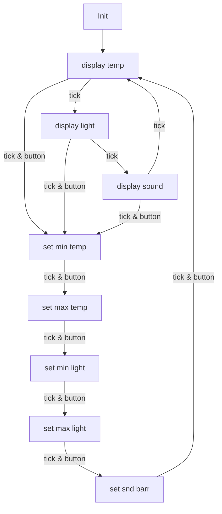

# Smart Ambient Awareness System
The Smart Ambient Awareness System is an embedded application and system developed using the mbed C++ library.  
It monitors light sensitivity in lux, sound in decibels, and temperature in Celsius. If any of these values fall outside a specific range, the user will be notified by a light signal.  
Furthermore, the user can adjust the ranges using a potentiometer. To do this, they have to access a settings menu by pressing a button. The specific change domains are documented below.

## User Interface
The user interface of the embedded system consists of the following parts:
 - 1× LCD Display  
 - 3× LEDs  
 - 1× Button  
 - 1× Potentiometer


### LCD Display
The LCD Display is the most important part of the user interface of this system. In general it is communicating two different domains with the user. Firstly the measures and the interpretation of these measures, and secondly the setting menu for the ranges of the variables.

#### Measures
The LCD Display is displaying the value measured by the three sensors one after another. The different values will be displayed as integer numbers and follow a shortcut for the variable. The shortcuts and the long form of these shortcuts are displayed in the table below. The measurements (_dB_, _lux_, _°C_) will not be displayed beside the numbers because they are all in their standard form and well interpretable by the user.

| long form   | short form |
|-------------|------------|
| temperature | temp       |
| sound       | sound      |
| light       | light      |

Furthermore it is displaying if the at-the-moment presented value needs to be changed and in which direction it needs to be changed. This is done by the color of the background of the LCD Display. The colors and their meaning corresponding to the different measurement variables are displayed in the following table.

| variable | color | (decrease/increase) |
|----------|--------|---------------------|
| temp     | red    | decrease            |
| temp     | blue   | increase            |
| light    | red    | decrease            |
| light    | blue   | increase            |
| sound    | red    | decrease            |

#### Setting Menu
The Setting Menu is displaying the max and min value, or the barrier in the case of sound, for every measurement. These barriers can be changed in a specific range which was selected by us. The following ranges are possible:

| barrier     | range   |
|-------------|---------|
| min temp    | 15–25   |
| max temp    | 25–35   |
| min light   | 200–400 |
| max light   | 400–600 |
| sound barr  | 40–120  |
  
### LEDs
Beside the backlight of the LCD Display, the LEDs are also providing the user with information on how the temperature, light, and sound should be changed to keep a comfortable environment in the room the system is monitoring.  
The following table will help the user to decrypt the meaning of the light signals. The LEDs are represented from left to right as L1, L2, L3, and 0 means the LED is inactive while 1 means the LED is active.

| L1 | L2 | L3 | meaning                   |
|----|----|----|---------------------------|
| 0  | 0  | 0  | temp is comfortable       |
| 0  | 0  | 1  | light is comfortable      |
| 0  | 1  | 0  | sound is comfortable      |
| 0  | 1  | 1  | temp needs decreasement   |
| 1  | 0  | 0  | light needs decreasement  |
| 1  | 0  | 1  | sound needs decreasement  |
| 1  | 1  | 0  | temp needs increasement   |
| 1  | 1  | 1  | light needs increasement  |

### Button & Potentiometer
The button and the potentiometer are necessary for interacting with the setting menu.  
When the button is pressed, it will change between the different menus for setting the comfort ranges and the main display routine.  
While one of the setting menus is activated, the user will be able to use the potentiometer to change the value within the corresponding range mentioned above. A rotation to the left will increase the values, while a rotation to the right will decrease them. When the button is pressed, the set value will be saved.
It is necessary to mention that when the button is pressed, the setting menu is changed, and the value in this menu is directly adjusted according to the angle of the potentiometer. This means that the user might be forced to remember the old values if they want to edit just one of the values, because they are forced to set it manually back.
## Hardware Specifications
The software is written for an Arduino Nucleo board.

### Setup
The used hardware consists of several sensors, an LCD display, and the board. The connection of the different peripherals with the ports on the controller is displayed in the following table.

|peripheral|port|
|----------|----|
|temp sensor|A0|
|light sensor|A1|
|potentiometer|A2|
|sound sensor|A3|
|button|D4|
|LCD Display|D14–D15|

Furthermore, it is necessary to mention that the input voltage should be set to **5V**, because otherwise the peripherals will not work correctly.

## Software Documentation

### Setup

### Program Flow
The program follows a specific flow. This flow is displayed in the following Mermaid graph.  
A _tick_ in this case is an interrupt triggered by a timerinterrupt of the system. It is necessary to mention that this timerinterrupt runs at two different speeds:  
during the menu states {D, E, F, G, H} at **500 ms**, and during the display of measurements {A, B, C} at **2 s**.  
This ensures convenient reading time for the user while maintaining high responsiveness when adjusting settings.



```

### Further
**File Descriptions:**

|- **main.cpp**: The entry point of the application; handles the libraries for the different hardware components.  
|- **StateTable.(h, cpp)**: State machine that handles changing the thresholds of the sensors based on button presses using interrupts.  
|- **SoundSensor.(h, cpp)**: Handles the sound sensor, reads the noise level, and implements a function for setting the sensitivity of the sensor.  
|- **Thermistor.(h, cpp)**: Handles the thermistor, reads and calculates the temperature, and implements a function to switch the temperature between Celsius and Kelvin.  
|- **LightSensor.(h, cpp)**: Handles the light sensor, reads and calculates the light level, and implements functions to convert the measurement from Lux to Kilolux and to switch the voltage between 3.3 V and 5 V.  
-- **Grove_LCD_RGB_Backlight.(h, cpp)**: Handles the LCD display and contains functions such as setting the background color, clearing and writing to the display, and positioning the cursor.


